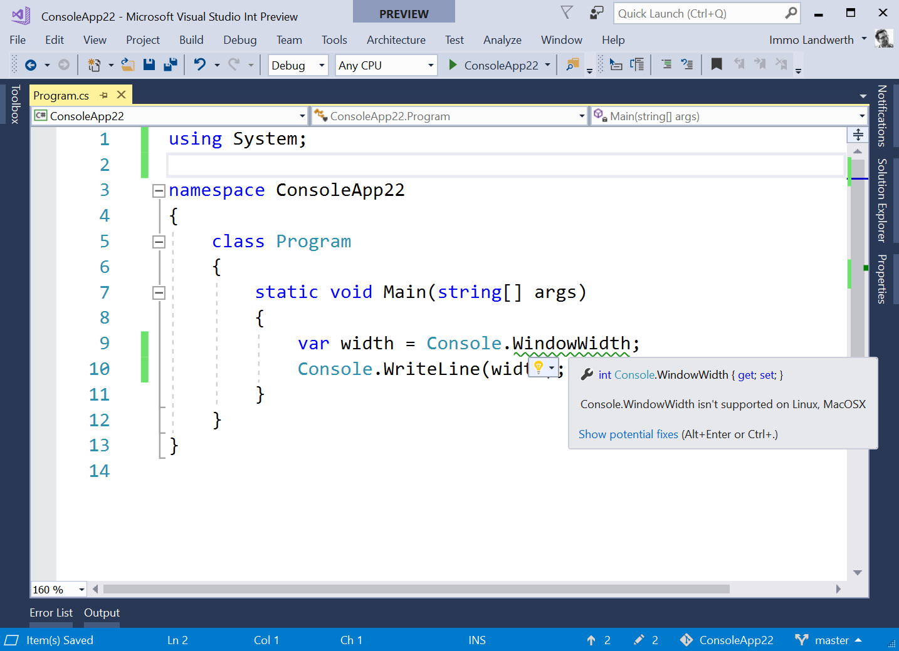
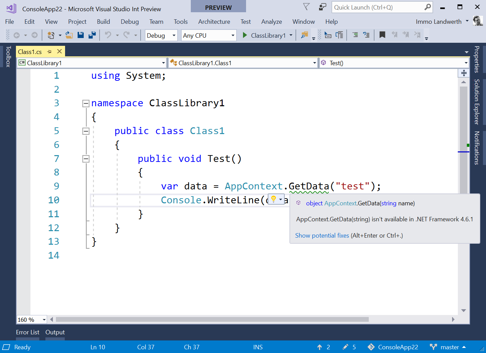
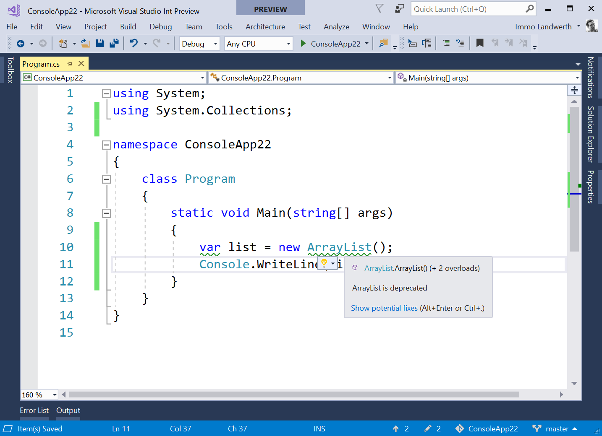

# Platform Compatibility Analyzer

[](https://ci.appveyor.com/project/terrajobst/platform-compat/branch/master)

This tool provides [Roslyn](https://github.com/dotnet/roslyn) analyzers that
find usages of .NET Core & .NET Standard APIs that are problematic on specific
platforms or are deprecated.

## Usage

In order to use it, install the NuGet package [ApiCompat.Analyzers](https://www.nuget.org/packages/ApiCompat.analyzers).

## Experience

### Usage of .NET Core and .NET Standard APIs that throw `PlatformNotSupportedException`



See [PC001](docs/PC001.md) for more details.

### Usage of .NET Standard 2.0 APIs missing from .NET Framework 4.6.1



See [PC002](docs/PC002.md) for more details.

### Usage of deprecated APIs



See [DEXXX files in the docs folder](docs) for more details.

## Nightlies

The feed with nightly builds can be found here:

```
https://ci.appveyor.com/nuget/platform-compat
```
