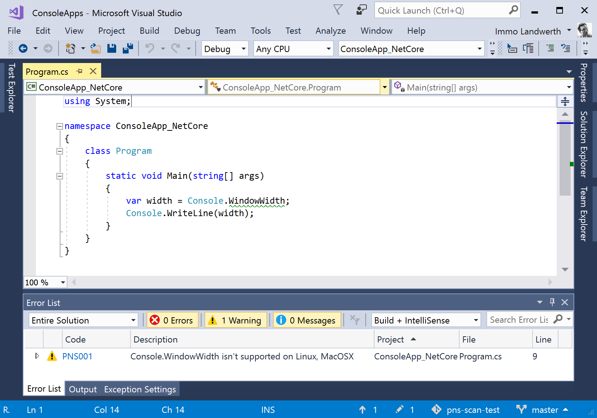
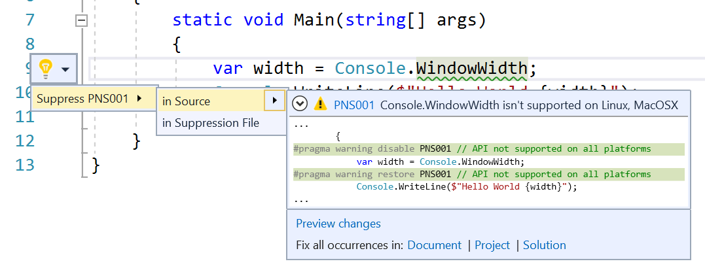
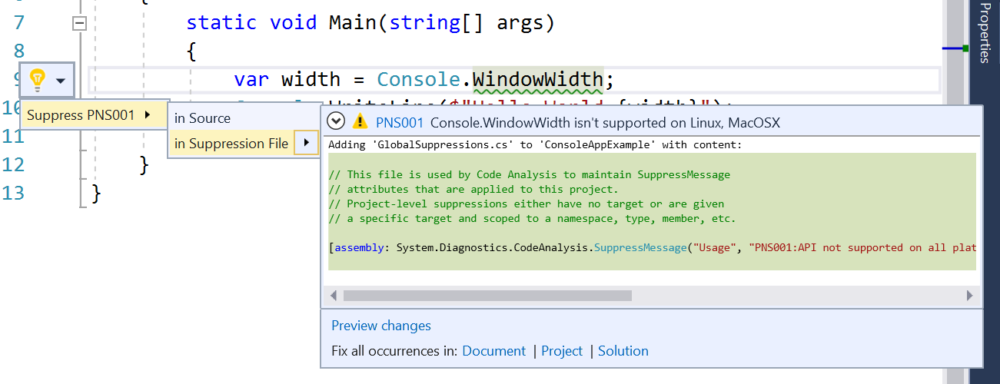

# Platform Compatibility Analyzer

[](https://ci.appveyor.com/project/terrajobst/platform-compat/branch/master)

This tool provides a [Roslyn](https://github.com/dotnet/roslyn) diagnostic analyzer
that finds usages of APIs that will throw `PlatformNotSupportedException`
on certain platforms.

The experience looks like this:



## Usage

In order to use it, install the NuGet package [Terrajobst.PlatformCompat.Analyzers](https://www.nuget.org/packages/terrajobst.platformcompat.analyzers).

## Nightlies

The feed with nightly builds can be found here:

```
https://ci.appveyor.com/nuget/platform-compat
```

## Suppressions

1. **Current call site**
   
2. **Project scope**
   
3. **Arbitrary scope**. Put the suppression from (2) in specific file and share
   between projects as needed.
